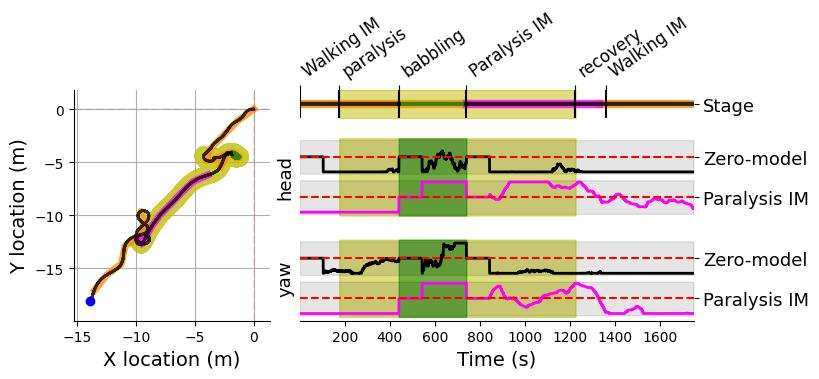
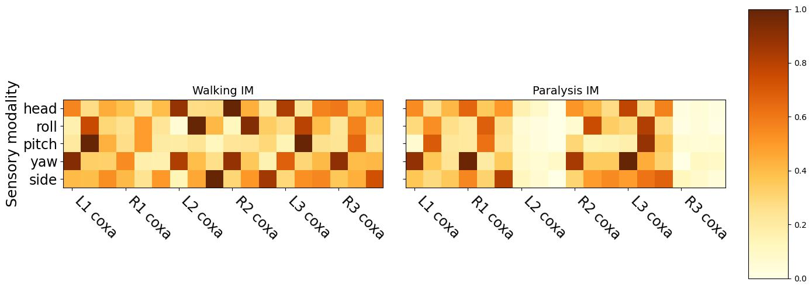

# Lifelong Active Inference of Gait Control
This script performs a simulated experiment where a walking hexapod robot is partially **paralyzed** for and then **recovered**,
where the robot must recognize both changes in dynamic context and adapt to them continually in real-time.
The implemented method [1] dynamically selects and expands ensemble of internal models, where the selected model is utilized for model-based gait control.
This experiment demonstrates the method's capability to continually learn the sensorimotor interaction in changing environment.

## Install
The software is tested on [Ubuntu 20.4.](https://releases.ubuntu.com/20.04/). To run the experiments the python libraries and the simulator must be installed:

1. The software requires [Python 3.8.0](https://www.python.org/) with packages listed in *requirements.txt* file. To **activate a virtual environment** and install the requirements run:
```setup
git clone git@github.com:comrob/laicg.git
cd laicg
python3 -m venv venv # create virtual environment
source venv/bin/activate # activate virtual environment
pip install -r requirements.txt # install requirements into virtual environment
```
> Note: The *venv* (virtual environment) is installed in the *laicg* folder.
2. The robot is simulated in [CoppeliaSim](https://www.coppeliarobotics.com/) which should be installed on your machine. Tested versions: 4.3.0 (rev. 10.), 4.6.0 (rev. 18.).

```setup
wget "https://downloads.coppeliarobotics.com/V4_6_0_rev18/CoppeliaSim_Player_V4_6_0_rev18_Ubuntu20_04.tar.xz"
tar -xf CoppeliaSim_Player_V4_6_0_rev18_Ubuntu20_04.tar.xz
cd CoppeliaSim_Player_V4_6_0_rev18_Ubuntu20_04
./coppeliaSim
```
## Running the experiment
Runs a paralysis and recovery experiment with prelearned walking model.
1. Open the scene *resources/coppeliasim/_plane.ttt* in the CoppeliaSim.
2. Activate the virtual environment. Then run the experiment and its evaluation with following commands:
```setup
python -m paralysis_recovery_test.run my_new_experiment test --transfer example
python -m paralysis_recovery_test.run my_new_experiment eval
```
>  This should take around 30 min. 
> After the experiment, the collected data are postprocessed, which can require up to 8GB RAM.

## Training the model
Runs the entire pipeline which learns walking model, tunes the sensitivity threshold. 

1. Open the scene *resources/coppeliasim/_plane.ttt* in the CoppeliaSim.
2. Activate the virtual environment. Then run the experiment and its evaluation with following commands:
```setup
python -m paralysis_recovery_test.run my_new_experiment learn
python -m paralysis_recovery_test.run my_new_experiment tune
python -m paralysis_recovery_test.run my_new_experiment test
python -m paralysis_recovery_test.run my_new_experiment eval
```
> This should take around 75 min.
> If 'AssertionError: Conection to hexapodfailed' appears, restart the simulator.
### Evaluation
The **eval** command generates files in *paralysis_recovery_test/results/reports*.
1. On the right, log-odds evolution ( zero-model:best model (black), paralysis:walking (cyan)) where the value lesser than zero (below the red dash line) indicates that the former is less likely than the latter. On the left, the result path of robot going towards goal location [-100,-100].
   1. 
   2. 
2. Comparison of Walking and Paralysis internal models. The normalized parameters show the sensorimotor coupling strength. The Paralysis IM has low coupling strength for middle left (L2) and rear right (R3) legs.
   1. 
3. Expected results computed from recorded data.
   1. 

#### References
[1] R. Szadkowski and J. Faigl, Lifelong Active Inference of Gait Control (unpublished)
