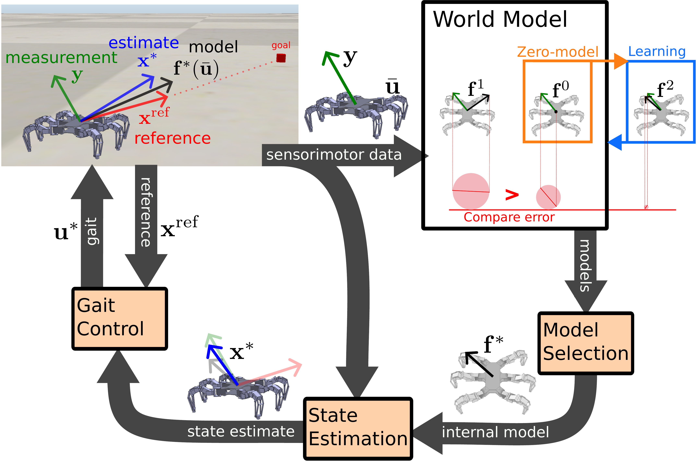
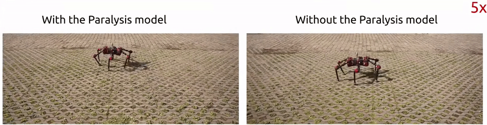

# Lifelong Active Inference of Gait Control

This script implements the gait control learning method proposed in the paper [Lifelong Active Inference of Gait Control](https://doi.org/10.1109/TNNLS.2025.3579814), which learns and adapts its gait control in real-time while interacting with the environment. The method employs two cognitive models for motor control: [Active Inference Control](https://doi.org/10.1016/j.jmp.2017.09.004) and [Internal Model (IM) ensemble](https://doi.org/10.1016/S0893-6080(98)00066-5). 

The robot processes **sensory measurement** with its **World Model** to infer action achieving a given **sensory reference**. Over time, the method autonomously decides when to expand its World Model by learning a new IM which **allows the robot to adapt its gait control to new situations**.



The method is demonstrated in a simulated experiment with a hexapod robot that has **paralyzed** legs. The robot decides to extend its World Model by **learning the Paralysis model** resulting in **paralysis compensation**. 


After a time, the robot **recovers** from paralysis and perceives sensory input similar to that before the paralysis thus the robot **selects the Walking model** and **recalls walking with all legs**. 


The proposed method was deployed on a real hexapod robot, where the robot was able to learn and adapt its gait control in real time.



<!-- For further details, please refer to the [documentation](https://comrob.github.io/laicg/). -->

## Quickstart

<details open>
<summary><b> Requirements </b></summary>
 
 - Tested on [Ubuntu 20.4.](https://releases.ubuntu.com/20.04/)
 - [Python>=3.8](https://www.python.org/)
 - [venv](https://docs.python.org/3/library/venv.html)

</details>

<details open>
<summary> <b> Installation </b> </summary>

1. Install the software and open the virtual environment:
```bash
git clone git@github.com:comrob/laicg.git
cd laicg
python3 -m venv venv # create virtual environment
source venv/bin/activate # activate virtual environment
pip install -r requirements.txt # install requirements into virtual environment
```
> Note: The *venv* (virtual environment) is installed in the *laicg* folder.
2. The robot is simulated in [CoppeliaSim](https://www.coppeliarobotics.com/) which should be installed on your machine. Tested versions: 4.3.0 (rev. 10.), 4.6.0 (rev. 18.).

```bash
wget "https://downloads.coppeliarobotics.com/V4_6_0_rev18/CoppeliaSim_Player_V4_6_0_rev18_Ubuntu20_04.tar.xz"
tar -xf CoppeliaSim_Player_V4_6_0_rev18_Ubuntu20_04.tar.xz
cd CoppeliaSim_Player_V4_6_0_rev18_Ubuntu20_04
./coppeliaSim -f ../resources/coppeliasim/_plane.ttt
```

</details>

<details open>
<summary> <b> Execution </b> </summary>

3. **Open new terminal in the project root:** Run the experiment and its evaluation with the following commands:

```bash
source venv/bin/activate # activate virtual environment
python -m paralysis_recovery_test.run my_new_experiment test --transfer example
python -m paralysis_recovery_test.run my_new_experiment eval
```
> The full experiment and evaluation typically takes around 30 minutes to complete.
> After the experiment, the collected data are postprocessed, which can require up to 8GB RAM.
> Performance may vary based on machine specs

</details>

<details open>
<summary> <b> Results </b> </summary>

4. The **eval** command generates files in *paralysis_recovery_test/results/reports*.
   1. 
   2. 
 > On the right, log-odds evolution ( zero-model:best model (black), paralysis:walking (cyan)) where the value lesser than zero (below the red dash line) indicates that the former is less likely than the latter. On the left, the resulting path of the robot is going towards the goal location [-100,-100].
   3. 
 > Comparison of Walking and Paralysis internal models. The normalized parameters show the sensorimotor coupling strength. The Paralysis IM has low coupling strength for the middle left (L2) and rear right (R3) legs.
   4. Expected results computed from recorded data: 

</details>

## Acknowledgments
This work was supported by the [Czech Science Foundation (GAČR)](https://www.gacr.cz/en) under research project No. 21-33041J.

## Cite
If you use this code in your research, please cite the following paper:

```bibtex
@ARTICLE{laicg2025,
  author={Szadkowski, Rudolf and Faigl, Jan},
  journal={IEEE Transactions on Neural Networks and Learning Systems}, 
  title={Lifelong Active Inference of Gait Control}, 
  year={2025},
  volume={},
  number={},
  pages={1-12},
  doi={10.1109/TNNLS.2025.3579814}
 }
```